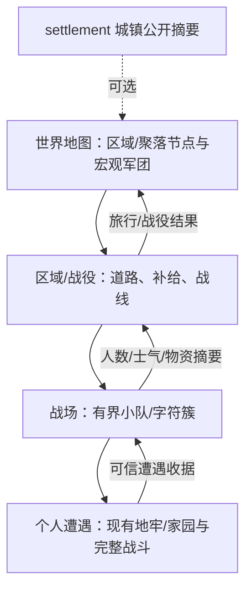
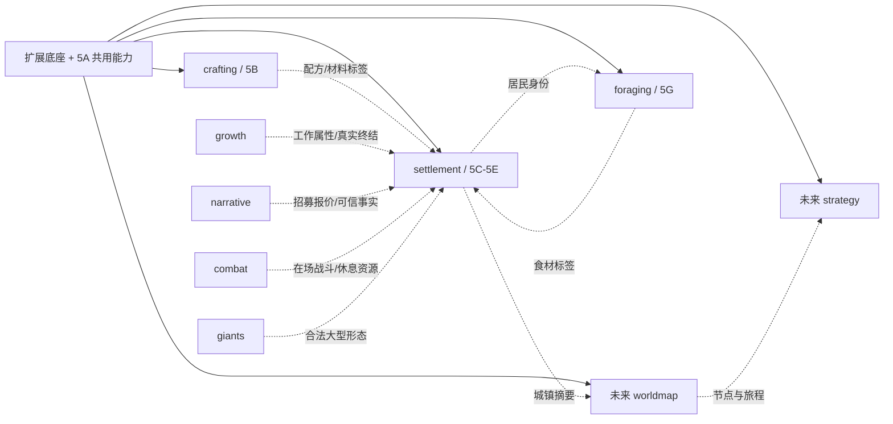

2026-10-09 5E1实施补注：固定开局袭击配置、普通原生波次/有限摘要、付费修缮及已批准A/A/A与被围离线暂停已接生产入口，已于`a9f554b`收口并推送，见[报告](phase5e1.report.md)。当前foundation13/world5 schema4/settlement1.3.0；下文此前5D1/5D2状态及“待5E”措辞按历史理解，旧草案的离层可获经济收益和可生成残敌不覆盖本轮A/A/A。

# 阶段 5 联合设计稿：远征营地、聚落建设与世界层

2026-10-09实施补注：5D2有限生产、农田/猎人/厨师及可选crafting已实现，当前未提交、待父独立审查，见[5D2报告](phase5d2.report.md)和[配置手册](settlement-config.md)。下文5D1状态按历史理解；当前采用foundation12/world5 schema3/经济1.2.0/settlement1.2.0，公开订单为order-work/resupply-work/cancel-order。地表/叙事/袭击/战争不在本步范围。

> **状态：设计稿待审。** 2026-10-06；分支 `ext/phase5-design`，只读审计基线 `9331104`。本轮只交付本文和 README 链接，不改代码、测试、数据或格式版本，不 commit。本文中的新类型、接口、预算、数值和规则都是提案；审阅通过不等于授权实施全部小步。
>
> 任务来源：[阶段 5 设计任务书](phase5-design.task.md)。政策来源：[扩展 README](README.md)、[底座架构](architecture.md)。阶段 3/4 已有功能的最终收尾门禁另行执行，本文不补作通过声明。

## 1 结论、范围与推荐边界

推荐保留 **5A 共用底座 + `crafting` + `settlement` + 后续 `worldmap` / `strategy`**。招募、工作和防御先作为 `settlement` 的独立实施小步，不新增 `colony` 模块：住所、库存、工作资格和袭击共享同一聚落事务，拆包会增加 provider 协商、跨包回滚和组合数量，却尚未形成独立玩法。将来若居民能在没有聚落时经营商队、庄园或军队，再提取通用职业调度或另立模块。

| 轨道 | 拥有内容 | 不承担的内容 | 推荐负责人 |
| --- | --- | --- | --- |
| 5A 持久世界底座 | 层身份/所有权、模拟时间、受控世界事务、结构与房间原语、容器与物品定义、工作动作/离线结算执行框架 | 房屋配方、居民需求数值、袭击内容、世界势力 AI | 本地 Codex；Claude 审查和集成 |
| 5B 资源与合成 | 独立 `crafting`：资源点、材料、工具、工作台、配方、合成物品、模块 UI | 聚落人口、房间政策、NPC 日程、修改共用 Game/codec | dot；合同冻结后整块派发 |
| 5C 营地与建造 | `settlement`：任意地牢层营地、可选地表家园、范围、结构/家具、补给、管理 UI | 复制 crafting 内核、传送、跨局家园 | 本地 Codex |
| 5D 招募与工作 | `settlement` 内居民来源、身份绑定、种植/生产/搬运/守卫、食物与住所、离线工作政策 | 将固定对话对象直接当作生物、全知 AI、自动刷成长 XP | 本地 Codex；5A 后可由另一位本地执行者并行 |
| 5E 防御与袭击 | `settlement` 内警戒、袭击计划、在场战斗和离场摘要 | 另一套命中/伤害解算器、强依赖 combat/giants | 本地 Codex；晚于 5D |
| 5G 野外采食（2026-10-06 增补） | 独立 `foraging`：野生蘑菇（每局随机外观、非魔法知识）、烤制/爆裂、同伴饥饿与喂食、菌丛节点；见[野外采食设计稿](phase5-foraging.md)（待审） | 营地、居民、厨师；任何 crafting 配方 | 底座 5A4 本地 Codex；模块 5G1–5G2 推荐 dot 整包 |
| 5F 世界层与战略 | 未来独立 `worldmap` / `strategy`：节点、旅行、战役、部队、身份指挥 | 本轮实现大地图、战争 AI 或放宽群体预算 | 本轮仅定分层和接口预留 |

2026-10-06 维护者批准增补独立 `foraging` 模块（[野外采食设计稿](phase5-foraging.md)）：它只硬依赖底座，不依赖营地，排在 5A3 之后、可与 5C 并行；与 settlement 只经食材标签和居民身份两个软接口相连。

首个可玩闭环是“D1 手工收集 → D5 建中继营地 → 留下补给与工作单 → 继续下潜 → 徒步返回领取产出、维修与补给”。地表可以加入这个网络，但不成为深层营地的必需前提。城镇首先是同一张个人层地图上的聚落阶段，不提前解释成世界地图上的国家。

本稿建议先实现有限建设：格子墙、门、窗、地板、屋顶和家具，单层房屋；不做高度、悬空桥、楼上楼下、完整流体工程、任意脚本配方或无限地图。传送、商业运输、跨局继承、居民繁衍和全世界战争另立任务。

## 2 只读审计：可复用能力与真正缺口

审计使用本工作树代码，不根据早期设计稿推断实现。参考资料包括 [成长设计](phase1-growth.md)/[配置](growth-config.md)、[叙事设计](phase2-narrative.md)/[配置](narrative-config.md)、[战斗设计](phase3-combat.md)/[配置](combat-config.md)、[巨兽设计](phase4-giants.md)/[配置](giants-config.md)和 [totalwar 笔记](references/totalwar-notes.md)。下表行号以 `9331104` 为准。

| 代码锚点 | 当前执行事实 | 阶段 5 裁决 |
| --- | --- | --- |
| `src/engine/Core/GenerationCoordinator.ts:244–316,430–448` | `visited` 层缺真实缓存会报错，不重新生成；离层放入 `levels`，入层移交到 Game 后删除该缓存键 | 已访问层长期存在已有保证；`levels.delete(target)` 是消除活动层别名，不是清理世界。先补登记/守卫，不重写一个“永久营地副本” |
| `LevelState.ts:12–30`；`WholeRunSnapshot.ts:99–188,232–284` | 当前层与缓存层都保存地图、环境、实体、物品、离开时点；整局编码建立跨层实体图；区域引用必须有真实层 | 容器内容、结构、居民及离线账本必须进入真实所有权根/codec，不能只在模块 JSON 保存活对象或第二份层快照 |
| `Game.ts:10793–10809`；`GenerationCoordinator.ts:437` | 新图环境预跑 50 次，重访最多 100 次；借历史 `absoluteTurnNumber`，最后恢复；不推进居民工作、饥饿、充能或实时动作 | 不是长期世界模拟。营地层需显式离层政策，不能把这段循环改成经过多少时间就跑多少次 |
| `TimeCoordinator.ts:116–241`；`Systems/Time.ts:1–25` | 调度按最小 elapsed 推进，环境每 100 tick；可选 actor-action 调度和核心唯一行动已有接线；`currentTick` 是输入簿记 | 新世界时钟应接真实 elapsed，不用命令数、墙钟或输入累计值冒充权威模拟时间 |
| `Game.ts:1751–1895`；`Movement/LevelTravel.ts:56–103` | 恢复居民处理跟随、落点、leader；相邻缓存层的跟随者仍会在客观块进入当前层 | 离场层不是绝对静止。居民与工作物资禁止隐式跟随；跨层到达属于该层的失效/结算边界，不能让离线算法继续使用旧快照 |
| `Grid.ts:864–871,1006–1033`；`TerrainRules.ts:14–60` | Cell 的四层 flags 派生通行/透明；`setTerrain` 会清其他层，`setTerrainLayer` 才保留其他层；多个消费者直接读取地形 flags | 结构不能只画在 UI 上，也不能用墙建设顺手清掉水/气体。需统一“基础地形 + 结构”的性质查询和失效机制 |
| `Promotion.ts:387–449,963–1048`；`Environment/Gas.ts:182–193,388–465` | Promotion/DF、燃烧与气体存在独立写入；gas 也直接改层再刷新 | 建造、毁坏、火/气体、法术改变地形必须共享结构感知入口；只改 Grid setter 会漏执行路径 |
| `Item.ts:12–27`；`Inventory.ts:7–84`；`EntitySnapshot.ts:11–18,99–101` | 当前没有材料类别/容器根；背包 26 字母，数量按类别计空间；序列化为显式字段表 | 新材料堆叠和容器所有权先做到底座；不能塞进 GOLD/GEM/FOOD 冒用其特殊规则。制造的武器/食物应是原生 Item |
| `src/ext/regions.ts:3–53`；`runtime.ts:1175–1200` | owned region 是不重叠矩形、depth=1…40，整局最多 128；安装只接受真实生成 token | 运行中建立/扩张/撤销营地需新事务；不得伪造 generation token。营地范围不是居民永久硬运动边界 |
| `src/ext/world.ts`；`worldSpatial.ts` | 世界交互对象固定、可穿行、非战斗；安全放置及公开可见投影可复用 | 家具的阻挡由结构服务承担；对话 NPC 不是可招募生物，也不能直接加入怪物数组 |
| `Monster.ts:1714–1775`；`TimeCoordinator.ts:197–229` | 原生 prelude、战斗选择、原生 AI 与耗时补账已有分界；盟友仍主要跟随/作战，没有居民日程 | 工作意图插在同一次自由决策，危险优先；不能以工作调用玩家 `playerTurnEnded` 或重复执行 prelude |
| `ext/runtime.ts:180–181,1294–1297`；`ext/types.ts:227`；`ActorActionProduction.ts:99–150` | 只允许一个 actorActions provider，生产 scheduler 引用其私有 state；当前正式 provider 为 combat | “调度器在底座”不等于“无 combat 可用通用工作”。5A2 先迁唯一动作簿记/仲裁到中立底座，不能让 crafting/settlement 各安装一套 scheduler |
| `WorldRestProduction.ts:24–113`；`src/ext/worldRest.ts:1–46` | 有时长可打断休息已经存在，但绑定通过唯一 actor-action provider 的 bonfire ledger；`resetPolicy` 仅 none | 复用恢复执行规则，先补中立 RestPoint 接入。当前 settlement 不能直接调用 `combat.rest` 来休息，双 provider 也不能直接安装 |
| `Game.ts:4250–4292`；`LevelSeeds.ts:6–61` | D1 上楼是通关/禁止离开判断，地牢深度 1…40；没有地表层 | “地表=depth 0”不是已有能力。需单独 site 身份和 D1 路由；不能索引 `levelSeeds[-1]` |
| `ext/types.ts:27–34`；各模块 `definitions.ts` / `descriptor.ts` | foundation=4、manifest schema=1、整局/录像=3；growth=1.6.0、narrative=1.3.0、combat=1.4.0、giants=1.0.0 | dot 的 3g 底座升级尚未合入，阶段 5 不抢占 foundation=5，不预定下一格式号 |
| `ext/runtime.ts`；[架构 §20–22](architecture.md#20-阶段-2c-剧情事实与可选奖励提交) | 单剧情事实消费者/资源奖励事务不是任意世界事务，load 不发出生/奖励、不用 RNG | 招募、建造、容器转移及离线提交需各自显式写集；多消费者事实协议另补，不让事件回调偷改世界 |

本轮未实测性能、体积、浏览器或长局；后文数字都是实施预算/验收目标，不是审计跑分。已有文档中的历史 fixture、早期“未接线”及版本描述以当前代码和配置手册的生产说明交叉核对。

## 3 核心循环、原规则与零影响合同

### 3.1 两种聚落，共用一套规则

地表家园适合储存战利品、农业与集中生产；地牢营地适合近资源点取材、留守、恢复和中继补给。两者使用相同营地、容器、房间、工作单和居民需求；区别只来自地形、光照、资源、危险和可用范围。地牢可种菌类，不无条件种植需要日照的作物；地表也不会自动获得食物或居民。

节奏建议：先用小营地放箱和休息位，再补围墙、屋顶、床、工作台，招少量居民形成可持续补给；深入的新营地资源更好但护送、建材、食物和防御更贵。一次远征不必搬空所有物资，玩家携带量和徒步返程继续有意义。深层营地缩短补给距离，不取消下潜风险。

### 3.2 显式改变与保留

| 规则 | 不启用 crafting/settlement | 启用后的推荐规则 |
| --- | --- | --- |
| 饥饿/食物 | 沿现有行为 | 玩家饥饿继续推进；采集、建设、制造、休息都耗游戏时间。玩家不能自制食物；只有 settlement 厨师居民把食材加工成真实 FOOD（口粮），见 §8.3a；没有“营地范围内不饿” |
| 玩家死亡 | 原终局 | 仍结束整局，不自动复活；营地、居民和箱子进入该局终局快照，可检视/回放，不继续结算，也不转入下一局 |
| 地牢与胜利 | D1/D26/D40 原有路径 | 地牢层序、护符目标与终端保留；若启用可选地表，D1 上楼可到家园，持护符后用独立“结束远征”确认结算，D40 终端仍可结束。单独 crafting 不改出口 |
| 楼层生成 | 现有生成 | 已生成层不重掷；首次生成可放启用模块的资源点/居民，尊重机器、楼梯和 giants reservation；营地由玩家建立，不自然保证每层营地 |
| 离层环境 | 原最多 100 次补算 | 只有 settlement 登记的管理层采用 §5 的冻结生态/经济结算政策；其余地牢保留原路径 |
| 休息 | 现有原生恢复；combat 有自己的篝火 | settlement 的简易休息只给有时长、可打断的原生 HP 恢复；combat 缺席照常工作，有 combat 可软恢复其资源，不清饥饿/毒、不刷新敌人 |
| 装备与成长 | 现有物品/成长 | 手工装备走原生装备规则，首批固定已知 +0、无符文；不无限制造强化/生命/力量药水、护符或终局宝石；生产不给重复成长 XP |
| 移动 | 原行走/楼梯 | 玩家携物步行，护送居民走真实楼梯；没有全局箱共享、点地图瞬移或自动跨层运输 |

模块未启用时不安装其数据/组件/工作队列/离线域，不加采集点/地表/袭击，不多抽生成或规则随机数；只安装但不启用也一样。只启用 crafting 仍可手采、手工配方、放独立工作台；只启用 settlement 仍有基础建材来源、床箱/农田/基本补给。高级制造和高级招募不能成为这两个单模块闭环的唯一资源入口。

零影响是“未使用新能力的组合，玩法、机械状态和 RNG 不受新增能力影响”，不是要求永远保留旧 CE 全部规则或永久维持两套求值器。基础格式升级可以统一拒绝旧格式，不能宣称二进制/JSON 永久兼容；遵守当前扩展政策与不迁移决定。

## 4 层、营地与补给所有权

### 4.1 层身份和持久存在

提案 `LevelRef = {kind:'dungeon', depth:1…40} | {kind:'site', id:string}`；规范比较先 kind、再 depth/ID。世界层、区域、容器、工作地点和居民归属引用 LevelRef。地牢适配器继续使用 depth 驱动已有生成器；site 不进入地牢 seed 表，不借负深度/虚假 D41。首个地表 site 维持现有 **79×29** 地图预算，不扩无限地图。

新增层目录记录真实所有权、生成标识、离场时点和管理政策。当前层、缓存层是同一记录的两种承载状态；任何层只有一个地图/环境/实体所有者，营地只保存 `levelRef/regionId`。5A 首步可只接 dungeon 适配器，但冻结的公开 DTO 必须允许 site；真正地表进入单独 5C2 小步。

5C2 必须迁移 region/world/spatial/action/实体 codec 的层引用校验，而不是只给 Game 多一个 site 字段。既有仅有 minDepth/maxDepth 的生成贡献、narrative 放置和 growth 首访表限定匹配 dungeon；site 默认跳过这些规则，除非其模块另声明 site 资格。模块查询获得明确 LevelRef，不能把家园伪装成 D1 来领取首访或生成 Boss。旧 depth 字段只作为地牢适配值，不与 LevelRef 各自可写。

已访问层不删除。`persistenceReasons` 只记录营地、容器、居民、待事件等引用，供将来的内存卸载/磁盘冷存校验；它不是第二份地图。若将来卸载 JS Grid，须从真实持久层载回，禁止按种子再生。首版不做缓存淘汰或分片存储，优先复用整局编码并测量。

### 4.2 建立、扩张、撤销

推荐最多 **8 个活跃营地，地牢同层 1 个，可选地表也计入 8 个**。新营地初始 9×9，矩形扩张最大 24×20，受实际地图边缘限制。建立花少量基础材料并耗 300 tick；必须在当前已探索、当前可见、可达、无直接已知敌情的位置放营地标记。先清怪不是授予永久安全。

范围是 foundation-owned region，不能与巨兽场地/其他营地 region 重叠；矩形可以包围天然岩石，但有效建设/工作格必须可达且合法。扩张保持 region ID，只改变唯一 bounds，重新核验结构、工作岗位、通行和全足迹边界；首版不收缩非空范围，不允许跨层一个营地。篝火/资源点本身不宣告该区域所有权。

营地 owned region 表示管理范围，不自动把所有居民绑定 `movementRegionId`。普通居民以工作范围和最大寻路距离为软限制，可逃难/护送离开；明确留场守卫才按底座资格设置硬边界，解绑须经事务。大型居民首版不招募，避免受支配 giants 因营地强制绑定而失去已有场地归属。

拆除结构逐件进行。撤销营地先搬空/拆完，取消订单、解除居民归属、处理待袭击及休息目标、归还在途预留；任一物资无合法接收处就拒绝，不静默销毁。确认后退役标记/区域和活跃名额，历史收据留有界摘要。同层建筑全部移除仍不重生成该层。空营地也不能通过拆建重置种子、资源再生或袭击计数。

复用名额采用最多 8 个稳定营地 slot，各自创建序号/事件高水位永不回退；新实例 ID 可以变化，旧工作/袭击收据不会因拆建归零。自然资源账本仍跟节点 ID 保留，与营地生灭无关。撤销该层最后营地时先结到当前时点，移除管理政策，后续离场才恢复原生生态路径；剩余残骸/退款必须先解决，不能留下无 owner 的管理层。永久历史只保 slot 高水位和有限摘要，不无限保留每次拆建的完整对象。

### 4.3 储存、补给和转移

箱子是底座容器；其坐标/结构 ID/Item 引用在底座，settlement 仅保存用途/权限/补给额度。非堆叠装备保留原实体 ID、附魔、诅咒和鉴定状态。材料单位并入同类 stack；固定数量/最大 stack/槽数/CAS revision 都在同一转移事务核验，不浅拷贝物品。

箱内不自动充能法杖/护符，不自动鉴定、食用或回血；原生物品若需容器内充能，另定版本化政策。玩家存取需同层合法距离/交互线，每次批量转移耗 100 tick；查看是 0 tick。转移后 NPC/环境照常，查看远方营地只显示最后已知库存和时点，不隐式补算或显示确切未来产出。

初版箱子损毁：先核验可放出的 stack/装备预算，将内容转移到原格或稳定近邻地面，找不到容量/安全落点的剩余内容保存在可检索的残骸容器；残骸不能生产，可逐次回收。不凭空复制/吞物。火可按物品自身燃烧规则销毁暴露物，不因放箱就永久防火；离线袭击的有限物资损失另走 §9。

居民跨营地调动必须当前在场发护送/归属命令，并经每层真实落点与行程转移，没空间停留且给原因。初版无自动跨层物流；补给线 UI 只列已知步行路线和楼梯，不替玩家执行暗中运输。传送只预留 `TravelLink` 类型，不出按钮/配方。

## 5 时间与离线一次结算

### 5.1 一个模拟时间，两个执行精度

5A 在实际 `advancementLoop` 正 elapsed 提交点维护整数 `simulationTicks`，麻痹、长动作和等待按真实时间累计；同 delta 只累加一次。未使用此能力的组合不建立机械计时字段。环境补算、load、seek 重建、UI 打开和墙钟离线都不推进该时钟。

“离线”指玩家在别的层推进了游戏时间，关闭游戏过一晚不会产出。5D1 固定源使用唯一 world5.simulationTicks：在场动作仍沿原生调度；住房每1000tick、日粮每32000tick绝对边界结算，到期home包括cached层及escort归属，真实推进的安全点结需求，入层/有效机械触及前结清。5D1离场不种植、不搬运、不加工、不模拟生态；5D2现已实现本章有限离线生产；日粮与住房沿同一绝对时钟、在场与离场使用同票据及真实物料事务。

§5 的推荐采用 **1000 tick 一个经济周期，每张补给工作单最多执行 32 周期**。上限属于订单生命周期，不属于“一次结算调用”：分多次返回不能多得到 32 周期。超长离场以闭式计算处理停工后的食物消耗与短缺，绝不回放几百万个 tick。具体粒度/上限待 P5-D03 确认。

### 5.2 持久输入与输出

离开安全点保存冻结的离线输入：`levelRef / lastSettledTick / epochRemainder / revision / planId / remainingEpochs / seedKey / lastEventOrdinal`，结构/房间 revision、容器数量/槽位与预留、资源再生余数、居民 ID/存活/食物与床分配、订单进度/在途时间、路线可达摘要、已知威胁和待事件。基础世界不复制到模块；离线输入引用经校验的值快照，UI 不得到隐私/未见区域。

输入来源：离开时真实层快照 + `toTick-fromTick` + 底座派生种子 + 已冻结工作政策/规则指纹。输出是有限计划：Item/容器数量增减、工作进度、资源恢复、需求欠额、订单停止原因、袭击/设施受损摘要、待在场遭遇与收据更新。规划没有活 Game、RNG 全局指针、消息或写权限；提交才应用。

任务配置/容器/居民/结构变更时，先结到该机械边界，再修改，生成新 revision 的输入。由相邻层跟随、坠落、可信事件等跨层写入触及管理层时，也必须先结旧区间再写入并重建摘要。没有这道边界的写入口不得用于管理层。

### 5.3 有界经济递推与分段一致

每个完整绝对经济周期按以下固定顺序处理：

1. 上周期输出转入可用库存；按居民 ID 分配口粮（2026-10-06 起只在营地日边界周期执行，§8.3a）、按稳定 ID 计算床位。食物不足记录欠额，不扣玩家 nutrition、不把居民判为已死亡。
2. 检查危险、岗位/房间/工具、输入预留、输出容量、订单剩余周期；失效任务停工。工作优先级固定，再以 job ID/actor ID 排序。
3. 结算劳作信用与已付输入，生成下一周期可用输出；产出不得在同周期被另一离线任务继续加工。单周期最多 1024 次完成，固定预算不是按设备耗时截断。
4. 处理一个已登记袭击窗口/待事件，更新有限防御摘要与订单资格；得到一个下一状态，不在过程中发半条剧情或 UI 消息。
5. 推进绝对 epoch、消耗工作单剩余周期；存定点余数和唯一收据。管理统计与公开通知最后发布。

离线离开时冻结的路线长度、搬运负重/速度和工作剩余时长用于计算劳作信用；通行失败岗位从离开时即停，不假定居民瞬移到工作台。路线、护送、敌情或结构变化时立即形成新输入边界。首版不在离场层模拟具体路径上的每一次陷阱/格子战斗，离线与在场的空间精度不同是明确玩法近似，不宣称逐格结果相同。

在场工作通过原生正耗时动作累计实际劳作信用，同一个经济核处理库存/需求/完成；敌人打断、绕路、缺工导致信用较少，不重复发离线工资。未完成的采集/制造票据保留已付输入、进度和输出预留，切换精度只补剩余进度；一个 ticket 最多兑现一次。

32 周期耗尽后状态为 `needs-resupply`，不继续种植/生产/修复。之后只计算有限口粮可支持的周期数，消耗到零，短缺等级最多 3；不遍历剩余时间。重新工作必须显式在场下“补给并续工”命令，核验口粮/种子/材料，开启新 planId；load、查看、进出楼梯不续工。首版作物产出/加工链因此有实物、时间、仓容和补给单四重约束，不是无限 AFK 资源。

固定政策、无中间外部写入的区间必须满足 `settle(S,t0,t2) = settle(settle(S,t0,t1),t1,t2)`，包括余数、收据和派生随机；在周期中间保存/返回不重新开始周期。验收至少比较 0/999/1000/1001 tick、31/32/33 周期、极长区间，以及分 2/17 段处理的完整状态，不仅比较总产量。

### 5.4 原生环境、combat/growth 的边界

推荐管理层的离场政策为 **原生生态冻结 + 受控经济摘要**，替换该层重访时原最多 100 次环境 catch-up；不与经济算法各推进一次同一时间。冻结内容包括火/气体/水量、非工作生物位置/HP/原生状态、combat 资源与恢复期；返回时从真实冻结地图继续在场模拟。已有未解析攻击按原离层取消规则处理，不离线释放。

离开时正在燃烧、危险气体、原生敌情或不安全工作路线令相应工作停工；离场不会清火/毒、回满 HP/体力或让危险岗生产。返回危险仍在，下一真实环境块照常伤害。原生跟随者/坠落队列仍可通过可信迁层边界进入，需触发摘要失效；留守居民不登记自动跟随。新层生成的 50 次预热继续发生在首次登记营地之前。

这是有意改变营地层的离场生态，并不等同于“模拟了离线火灾”。若维护者要求离场火蔓延/洪水/中毒死亡，选 P5-D04 的另一方案，必须增加独立有界环境摘要和因果/物品损毁事务，不能恢复旧 100 次随机预跑后声称代表长期天气。

growth 自己的时钟/临时效果截止沿其规则；本框架不给缓存生物补专注、升级、免费回血或重授出生收益。combat 当前资源冻结合同保持；不得将经济 elapsed 再传给 combat scheduler。跨模块资源变化仅在批准的软 provider 同事务提交。

### 5.5 种子、提交、录像与 seek

新增底座 `offlineDraw(seedKey, absoluteEpoch, eventKind, ordinal)` 提案：由本局种子、LevelRef、稳定营地 ID、领域 ID 和规则版本规范派生，使用引擎定义的固定整数算法/编码和测试向量，返回无状态确定抽样。相同事件键结果固定，重访/分段不会重抽；不使用 JS hash、Math.random 或墙钟，也不占用显示随机流。

当前 module context 只有 `randomInt` 实质流，**没有这个 API**。该能力是底座新增的规则随机域，必须纳入 manifest/规则指纹；规则仍由引擎掌握。原实质/装饰两流状态继续保存，离线派生域另校验 seedKey/ordinal，不冒称只有旧双流就覆盖全部新增随机状态。手动采集/合成首版产出固定，不抽概率；在场原生战斗继续走实质 RNG。

入层顺序：冻结离开层 → 移交/恢复目标真实层 → 纯离线计划及完整预检 → 同步事务提交目标世界/模块/收据 → 合法玩家落点/居民恢复 → enteredLevel 放置/事实 → 原命令最终 checkpoint。异常回滚写集、ID、账本、消息和会话索引；失败不得半发布生产、袭击或出生。load 仅恢复/验证；不在 onLoad 补算。保存允许未物化的离场区间，必须保存足够重建它的输入和时点。

每个真实输入 checkpoint 覆盖结构、容器、订单、离线摘要/余数、居民引用和全部随机域。seek 经同一新局/命令路径重建，入层结算同样只执行一次；不等动画、不读当前 UI 缓存。确认 No、陈旧 revision/目标、无容量、非法 payload 在扣料/取随机/ID 前拒绝；错误 provider 不能伪装缺席。

## 6 结构层、建造与房间

### 6.1 一份机械结构，不扩大原四层数组

推荐基础四层地形继续保存天然岩石、液体、气体、表面效果；新增稀疏结构记录，**不是把 DungeonLayer.COUNT 改为 5/6**。每结构格可含 floor、barrier（wall/door/window 三选一）、roof、fixture；各部件有定义 ID、建材、HP/最大耐久、门开闭和 owner/region 引用。实际 HP/开闭唯一保存在底座，settlement 不另存墙耐久。

结构定义贡献只来自启用模块，机械字段有限 JSON：阻挡移动/视线/弹道/气体/液体、可燃性、抗性、maxHp、拆卸返还比例和建造费用/耗时。家具可通行或阻挡，与世界交互对象分工：交互对象给可见入口，结构给占格/机械性质，不用固定非战斗对象冒充有碰撞家具。

底座统一 `cellProperties` 合成基础 flags 与结构 flags，`terrainFlagsOfCell`、isPassable/isOpaque、FOV、寻路、气味、射线、法术、DF/Promotion、气体扩散、渲染与记忆一起接入。直接读取基础层的消费者须逐条分类：基础类型读者可保留，机械阻挡读者必须改走合成性质。生产不能在只迁 FOV、未迁 gas/DF 的半完成状态开放墙建设。

底座在批量建造/开门/毁坏提交后统一失效地形 revision、空间图/位姿图、工作路线、房间、光照/FOV/记忆和 loop/waypoint 派生值；不以重新生成地图刷新。`setTerrain` 的清层行为不能作为建筑放置原语。Promotion/DF 对结构格产生受控“基础层变化/结构损伤/销毁”意图，同一边界完成；移动、物品或法术仍可合法摧毁建筑。

### 6.2 部件性质和放置限制

| 部件 | 推荐机械行为 |
| --- | --- |
| 地板 | 标记可用室内地面，不封气/水；只能铺在稳定可通行地面，不把深水/熔岩/裂隙变安全，不覆盖机关/楼梯 |
| 墙 | 阻挡走路、视线、普通弹道、气体与液体横向扩散；木墙可燃，石墙不燃；既有液体不会凭空排走 |
| 门 | 关闭时同墙；开时恢复原地面性质，门柱不额外卡多格身体；开关耗时由原生门动作适配器唯一提交，不附送免费移动/第二行动 |
| 窗 | 阻挡移动和普通实体弹道，允许视线与气体，故不能作为防毒气承诺；液体默认阻挡。法术是否穿窗由明确阻挡类型决定 |
| 屋顶 | 每格覆盖/住房资格，地表阻止直达日照；不额外阻挡平面走路/视线、不提供空气净化，不作为可站立上层 |
| 家具 | 床、箱、台、炉、种植床；单格首版，阻挡按定义。放置工作台时必须保留至少一个合法相邻工作位 |

建造仅限当前营地已知可达范围，玩家在相邻工作位；占有生物全部足迹、物品/箱、楼梯及保护格不得放阻挡物。不挖机器墙/impregnable，首版不任意挖天然岩石；资源矿点采集不等于把任意墙转成资源。天然墙可作为房间边界，但不是免费可拆建材。

不可封死上下楼梯、D40 终端、自己/居民唯一逃生路线或破坏已登记巨兽场地的合法通路。批量纯预检用当前完整足迹和玩家逃生图；不可见格不作可利用的精确“隐藏怪阻挡”反馈。建筑操作受视野/已知信息资格限制，不以失败原因泄漏未见实体。

编辑草稿零时间；每格施工正耗时（建议墙/地板 100、屋顶/门窗 200、家具 300 tick，最终由包数据控制）。大范围笔刷只产生有序施工草稿，一次草稿最多 16 格；确认后逐格发独立 `build` 命令，每格有自己的耗时、风险确认、最终安全点和录像 checkpoint。危险/材料不足即停止显示层施工队列，已建部分保留，未开始不扣料；读档/seek/退出草稿不恢复该临时队列。选择确认后也须重验。

拆除耗正时间，默认按剩余耐久比例向下取整返还原基础材料的 50%，建材不足/损毁不能套利。耐久 0 由统一损毁事务去除对应部件，保留可用基础地形，不抹液体/气体；房屋资格立即失效。屋顶失去闭合支持即标“不安全覆盖”、取消住房/工坊资格，首版不砸人/掉落连锁；主动拆卸才返还材料。

### 6.3 房间识别与功能

在当前层预算内全图四邻域 flood fill，天然/建筑阻挡墙、门框和窗作围合边界；门的开闭不改变拓扑边界，完整门被毁才打通。室内候选为稳定可用地面连通分量，每候选至少 2 格、最多 128 格；接触地图外边/未围合通道不算房间。仅每格都有有效屋顶且边界闭合才成为完整房间；地下天然顶默认不是玩家屋顶，需铺简易支架/屋顶标记以形成建筑房间。

四邻域不允许借对角角洞连接两个房间；墙体在对角视觉/运动上沿底座防双墙规则。屋顶覆盖不能跨未围合通道产生隐形房屋。算法不依赖屏幕上颜色，天然岩石作为边界只查询真实机械图。每次结构批量结束全层重算（79×29 有界），后续再评估增量，不先引入复杂拓扑缓存。

房间格集/ID和功能结果为派生缓存，不存第二份房间地图；居民分配通过床/工位稳定结构 ID，而非易变 flood-fill roomId。功能标签允许多种，资源额度按真实设施计数，不因同一房间多标签重复发收益。

| 标签 | 条件 | 不满足时 |
| --- | --- | --- |
| 卧室 | 完整房间 + 至少一张床；一床一个合法住户 | 无住所欠额；床损毁不删除居民 |
| 仓库 | 完整房间 + 箱；箱可在室外使用，仓库只影响保护/工作资格 | 室外箱仍有基本存储，没有仓库加成 |
| 工坊 | 完整房间 + 台/炉 + 可达工作位；炉另要求通风条件 | 手工配方可做，室内限定订单停工 |
| 农田 | 可达种植格 + 土/种植床 + 水源资格 + 对应作物光照 | 农田是工作区标签，可露天；不硬塞成闭合屋顶房间 |
| 菌圃 | 可达种植床 + 低光/水源资格，允许地下 | 缺种子/水源停工，不把矿灯当阳光 |
| 警戒点 | 合法守卫岗位 + 逃生/视野条件，可露天 | 无岗位不提供抽象防御值 |

窗通风、炉的空气需求首版是明确资格标签，不实现氧气物理；不允许把屋顶覆盖解释成真实密封。墙/屋顶建材、自然光与炉点燃产生的火/气体影响需要在场实际测试。

## 7 5B 可开发契约：资源、材料、配方与工作台

本节是交给 dot 的 **冻结合同候选 C5-1**，不是当前 TS API。先由本地在 5A2/5A3 提供底座实现和真实 fixture；维护者批准合同及本文待决项后，dot 才能开始正式 5B。签名变化由本地提供新合同版本，不让 dot 临时修改 Game 解决。

### 7.1 物品与资源点模型

底座提供启用模块自有 `ItemDefinitionContribution`：`owner/id/nameKey/descriptionKey/category/glyph/color/maxStack/unitWeight/nativeTemplate`。追加 MATERIAL 类别（不重排旧枚举），材料以 definition ID+质量=basic 为堆叠键，一个 stack 占一背包格，建议 maxStack=99；首版没有随机质量/词缀。工具有独立通用标签/耐久，不能作为可消耗材料匹配。普通武器、护甲、食物输出引用白名单原生模板，装配确定、已知、固定 +0，无额外生成骰；新增物品字段同步显式 codec/字段合同。

资源点的几何/容量/余数在底座唯一账本，crafting 保存定义/放置收据与模块配置。完整运行行拟为：`id/owner/definitionId/instanceKey/levelRef/at/capacity/remaining/regenRemainder/lastSettledTick/revision`。首版单格、不阻挡、不覆写地形；矿点可邻天然墙交互，必须有真实合法工作位。无容量拒绝采集，不能以装饰 glyph 表示存在但无限抽资源。

定义字段及精确约束：

| 字段 | 类型/范围及含义 |
| --- | --- |
| `id / nameKey / descriptionKey` | 包内唯一命名空间 ID / 自有 locale 键 |
| `kind` | wood、stone、ore、fiber、fungus 五种有限分类；行为由字段决定，不检查某个 ID |
| `yield` | 固定 1–8 项 `{itemDefinitionId,count:1…99}`；本包实际定义引用 |
| `capacity` | 1…9999；初始 remaining=capacity |
| `harvestTicks / unitsPerHarvest` | 1…10000 / 1…99 且不大于 capacity；首批建议 100 tick 取 1 单位 |
| `requiredToolTag` | 通用标签或 null；null 允许徒手。工具只验当前实际持有/合法使用 |
| `regeneration` | `none` 或 `{units:1…99,intervalTicks:1…1000000}`；满量清余数，不积超额信用 |
| `placement` | dungeon 深度范围/每层/整局数量、稳定候选资格；site 规则独立，不混入 depth=0 |

木/纤维/菌类可再生，石矿/金属默认有限；不承诺所有资源点可再生。再生按 `floor((余数+elapsed)/interval)` 限容量，手采前机械结算同一节点，在 UI 查询时不变。资源在普通未管理层也能再生：节点自有整数时点，不需后台模拟或强制切换该层生态政策。

### 7.2 配方包

拟完整根字段：`schema:1,moduleId:'crafting',moduleVersion,rulesVersion,materials,tools,resourceNodes,stations,recipes,limits`；所有对象严格未知键拒绝、有限整数、唯一 ID、引用校验、无脚本。模块机械数组顺序进入 canonical fingerprint；文案/显示资源独立 displayVersion。自有目录包括 descriptor/module/schema/definitions/data/state/view/ui/locales/tests/test-suites。

每条配方精确字段：`id/nameKey/descriptionKey/inputs/outputs/stationTags/toolTag/workTicks/offlineEligible`。输入是指定 definition ID 及正数量，首版无“任意某材料”自动替代、隐藏技能条件或玩家自报产出。输出限定材料、白名单 +0 装备、普通食物/道具、家具套件；设施施工由 settlement 接受通用 kit/tag，不由 crafting 写结构。

工作台定义：`id/nameKey/descriptionKey/stationTags/placementCost/workPositionPolicy`；stationTags 去重排序，候选工作位相邻且可达。crafting 单独启用时可付材料放置底座单格台/世界对象，不要求房间；有 settlement 的“需工坊配方”由 station 公开资格补充，未提供相应资格就不给那个高级配方，不阻断手工配方。

一批制造 `batchCount=1…16`，总输入/最大输出/耗时预先核验安全整数；库存按明确玩家背包或同层邻近箱选择，不自动扫描全世界。菜单先显示所选来源和缺项。首批工序 `workTicks=100…10000`，劳动者共享资格和流程；NPC 内部 actor scope 和玩家公开入口分开。

C5-1 首个闭环的固定样例建议如下，作为 dot 的验收 fixture 和正式内容候选；维护者一次批准后可直接写包，不再由 dot 挑选魔法道具或装备平衡。模板 ID 已核对当前 `src/data`；物品装配不能调用会抽附魔/诅咒的随机 spawn 路径。

| 样例 | 输入/动作 | 输出与限制 |
| --- | --- | --- |
| 基础徒手资源 | `crafting.wood-node` 容量20、100 tick/单位、每2000 tick恢复1；石节点容量20且不再生；纤维节点容量20、每1000 tick恢复1 | 分别输出本包 wood/stone/fiber 材料；初始工具不是采这些节点的前提 |
| 手工工具 | 木2+石2、500 tick、stationTags=[] | 一个带 basic.pick 标签的镐；仅工作工具，固定耐久，不伪装随机武器 |
| 桌上短剑 | 金属4+木1、1000 tick、station.table、无工具要求 | 一件原生 `dagger` 模板；+0、无诅咒/符文、已知、batch≤16 |
| 皮甲 | 纤维6+皮革4、1500 tick、station.table | 一件原生 `leather_armor` 模板，同样固定；皮革来自本包明确资源源，不假定修改怪物掉落 |
| 床/箱套件 | 木4+纤维2 / 木6、500 tick、station.table | 各一个家具套件，带公开 kit.bed/kit.chest 标签；无 settlement 时可保存/搬运，不暗中生人口 |

（2026-10-06 修订：原“炉上口粮”样例与菌类源已删除，菌丛归独立 `foraging`，玩家不能自制食物；火炉保留并以 `station.hearth` 标签供 settlement 炊事软匹配，见 [5B 任务包 §1.4](phase5b.dot-package.md#14-2026-10-06-修订维护者批准)。）

金属/皮革源也归 crafting 包并有有限/再生定义和工具条件；高级配方缺资源只灰态。每局 crafting 自身可提供一次有收据的少量建台启动材料，首次入层保证尝试放一个徒手可用资源源；无合法空位明确 skip/defer，不改楼层来硬放。startup bill、各源产量/深度、台费用和工具耐久在 5A0 的派发任务中一次列全；它们是平衡数据，不留给 dot 以临时发消息问逐项选择。

### 7.3 命令、生命周期和事务

公开外层沿既有 `{module,action,payload}`，经 `executeCommand('ext:command',JSON.stringify(input))`；payload 严格版本/revision，不能提交 actorId、任意 state 或结果数量。

| action | payload 候选 | 成功语义 |
| --- | --- | --- |
| `harvest` | `{v:1,nodeId,revision,destinationId}`；背包 destinationId=null | 同层可见/距离/工具/容量/空间预检，预留固定输出，正耗时工作完成才扣节点/发一次产出 |
| `craft` | `{v:1,recipeId,batchCount,stationId,sourceContainerId,revision}` | stationId/source 可为 null；从已选择合法来源预留输入、输出容量和工序，进入同一底座劳作动作 |
| `place-station` | `{v:1,definitionId,x,y,revision}` | 当前已知安全格，付本包台的建材，正耗时，底座放置；不偷调用 settlement 建造 |
| `cancel-work` | `{v:1,ticketId,revision}` | 只取消当前玩家可取消阶段；尚未完成批次退未消耗输入，已完成部分不倒退，无重复退款 |

底座工作票据：`ticketId/owner/actorId/levelRef/sourceIds/definitionId/inputEscrow/outputReservation/remainingTicks/completedBatches/status/revision`。输入一经承诺转入真实 escrow 所有权，不是把数量留在箱里另加布尔；单批完成同时消耗 escrow、提交输出、进度和收据。受伤/失能/离层/工位毁坏按统一中断：玩家当前未完成单批取消，未耗输入返原容器；无容量转残骸/托管返还槽，不能丢掉。居民可保存剩余工作票据进入离线政策。

采集开始预留单位，不立即给材料；节点损毁/外部失效取消未完成单位。取消退款不是再次产生资源。一次工作只落账一次正耗时，不把工作结束再附一次 attackSpeed 或玩家等待。显示草稿、No、已过期、无工具/无材料/无容量均 0 tick/0料/0随机/0 ID；确认答案沿共用 prepared 协议录制。

底座必须实现以下窄口，具体 TS 命名可在 C5-1 冻结时调整一次：

```text
readWorkContext(owner, knownTarget) -> 冻结 actor/节点/工位/库存/资格 DTO
planMaterialTransfer / planTimedWork / planResourcePlacement -> 一次性计划
commitWorldWork(plan, actorScope) -> committed | rejected（显式窄写集）
registerItemDefinitions / resourceDefinitions / stationDefinitions -> 启用时预检注册
queryStations / queryContainers -> 同层、已知且有权限的 DTO
subscribeCommittedWork(owner) -> 模块自身结果事实；不授予 Game 写权
```

**5A2 的调度改造是 SDK 前置条件。** 当前唯一 provider 模型不足以支持独立工作模块。推荐将 scheduler 的动作束身份、下一边界、耗时镜像和通用 ticket 生命周期移入 foundation/native run 的唯一动作根；combat 保留其资源/招式定义/结果账本，并通过 owner 标记引用底座 bundle，不同时留一份可写倒计时。工作、休息和战斗都是同一调度器的有界动作类型，按 actor 互斥；资源 provider 与动作调度所有者分开。迁移与 codec/版本联合实施，维护当前 combat+giants 的 core/source/part 资格、打断/费用和历史显示合同；不能靠创建第二个 WeakMap scheduler 绕过 runtime 的冲突检查。

无 combat 时，底座 timed-work/native-rest 自己能执行；有 combat 时仅在 actor 空闲且费用/资格合法时接收工作，并在同一权威安全点处理中断。通用 RestPoint 几何/定义归底座，settlement 与 combat 各保自有放置/使用收据；资源恢复由可选 combat provider 受控提交。该迁移先用底座 fixture 和现有战斗闭环验收，再发 dot；不能把“以后集成人会解决”留在 5B 的开发尾声。

纯计划可在准备阶段执行，底座持有计划身份及源 revision；异步等待只带数据，不保留写 context。失败注入覆盖箱→escrow→产出、实体 ID、资源剩余量、订单、模块 state、消息/事实和两流，不把当前 2c 奖励事务当作覆盖证明。

### 7.4 单模块闭环与软联动

settlement 自有少量基础定义：木/石/纤维、种子/口粮、床箱/手工施工 bill、基础菌圃；从自己的启动补给和有限基础采集/种植获得，不 import crafting JSON。crafting 自有完整资源/手工/工作台闭环；两者输出可通过底座的有限 material/station 标签互用。标签定义固定语义（basic.wood/stone/fiber/food、station.table/hearth/forge），匹配者按 definition ID 排序且由玩家明确选择；不能把“相同标签”默默转成同一个物品身份或跨包复制配方。

`crafting.recipe-catalog.v1` 提案为只读可用配方/资格 DTO；无 crafting 时 settlement 的生产岗位只做自己的基本种植、口粮、维修。居民请求某 crafting 配方经底座 `TimedWorkDefinition` 引用，输入/输出政策仍由其所有者执行，不从 settlement import crafting planner。多 provider 的 definitions 为有 owner 的并集，重复全局 ID/冲突标签语义安装时拒绝；不能由加载次序选一个。

成长可选 `growth.work-stats.v1` 只给可信 actor 的有限工作速度修正；缺席倍率 1。首版建议不接，所有居民基本效率相同；手工不以等级解锁，也不发生产 XP。非有限/超预算 provider 输出报错，不降级成“未启用”。narrative、combat、giants 对 5B 均非必需。

## 8 招募、日程和工作

### 8.1 招募来源与真实居民

居民是底座普通单格原生 actor，沿 Monster/Creature 的 HP、状态、关系、占位和调度。5D1 的 world5.residents 是home归属/人口索引；settlement:resident 组件保存 campId/campOrdinal、模式、床、岗位、班次与revision/停工原因，source组件保存来源消费事实；home ledger.residentStates唯一保存foodShortage/housingShortage/unfedDays/departed。票据材料在escrow，劳动信用在world5.residentJobs，倒计时在原生actorActions；不复制actor坐标/HP/物品或第二份欠额。

| 来源 | 必需处理 | 模块缺席/不合资格 |
| --- | --- | --- |
| 救出的俘虏 | 已真实解救且存活、单格且可合法护送，招募确认；保留 actor ID/装备/HP/原成长 | 没 narrative/growth 也可招；受支配动物不自动变工人，大型/群体首版仅保留盟友 |
| settlement 自生居民 | 本包有限原生人形模板及安全放置，首次可信生成/访问收据，人口/实体预算先检查 | 没 narrative 仍可招募；无位置 skip/defer，不重生成层 |
| narrative 招募候选 | 可选 `narrative.recruitment.v1`：只对明确配置的候选给一次资格报价；底座原子创建/绑定 resident actor 并更新原对象表现/关系收据 | 当前 narrative 是固定非战斗对象，协议尚无；缺 provider 跳过该来源，不扫描全部 NPC 强制转换 |

推荐 narrative 来源保留原对话身份，原子将固定对象入口转为真实居民的随身交互绑定（对象原位置/重复显示取消），不留下两个人。底座需要新的 actor-interactable 附着能力；当前 world 对象不能移动，这是独立接入小步，晚于无 narrative 招募闭环。死亡后该实例状态明确终结，不读档再招一次。

招募需当前可见/距离内、玩家与目标存活、安全输入边界、可用名额及补给报价；公开目标 ID 是被招募对象，不是可伪造的行动者 actorId。招募不回满 HP、不重授成长模板、不清疾病。关系、跟随/驻留、来源收据、入人口额度和可选叙事收据同事务；任一 provider 失败全部恢复。

### 8.2 行为优先级与日程

顺序：原生失能/死亡/俘虏资格 → 原生一次 prelude → 逃险/已知战斗 → 已付动作/守卫 → 食物/住所 → 玩家指派工作 → 待命。combat 的已接受忙态继续由原 scheduler 独占；工作不得绕过硬直/麻痹，战斗 fallback 不同 tick 再做一份工作。居民调度只占原生一次自由决策，并返回 handled/blocked/native-fallback 和正耗时。

首版三段循环班次：工作/休整/警戒，以模拟时间 phase 定义，不依赖现实昼夜；地表自然光另为作物资格。岗位 priority、job ID、actor ID 稳定排序，一名居民只认领一个 ticket；同物料/箱/工位预留互斥。寻路沿实际地形/门/占位，受阻一次重规划，仍无路正耗时待命并显示原因，不逐帧重跑。

5D1 岗位与班次通过 game.executeCommand 的 settlement assign-job/set-schedule 提交，模式/粮仓用set-residence/return-home/set-granary；招募和遣散各100tick并原生确认，其余成功管理0tick。换岗/改班/模式变更会取消已有在途票据并退款、销毁信用，不赠信用、不重置日界或需求欠额；改班有票据时回idle并需重新指派，尚未接受票据的工作计划不能一概说清空。查看可见卡片不等于可操作：指派岗位、改班、遣散及驻留操作需目标当前直接可见，玩家与目标Chebyshev距离≤1、有交互线，双方存活、可行动并满足资格/忙态门槛；岗位指派另需居民在home营地同层范围内。当前job只有idle/plant/haul/guard；5D2公开order-work/resupply-work/cancel-order已接入原确认/CAS，另有有限配方订单，不改变上述legacy岗位形状。

| 工作 | 5D1 当前在场能力 | 离场/后续范围 |
| --- | --- | --- |
| 基础种植 | 真实源箱种子→escrow→走种植床，1000有效劳动tick出1作物；完工回idle、每格每日至多1作物；接单前环境不符保计划等待，进入planting后失格按interrupted取消退款/销毁信用/回idle，条件恢复须重新指派 | 无离线产出/自动续种；完整农田留5D2 |
| 搬运 | 本营不同源/目的chest、真实Item与1…8件，100tick取货/交付及真实步行 | 不离线/跨层搬运 |
| 守卫 | work/watch和平回指定岗，rest归床旁，危险交回原生战斗 | 无离线防御值/战斗AI |
| 生产/维修/厨师/猎人 | 本步没有这些居民岗位 | 后续设计，不以当前5D1能力验收 |

没有“居民被派工作就永远免疫火毒”。原生在场 HP/状态/掉落走同一规则；群核心/成员不拆成多个劳动力。关系转换/被支配改变资格时立即取消岗位并退未消耗 escrow；不能以招募后状态刷相同生物多份工资。

### 8.3 食物、住所与成长

推荐只做食物/住所双需求，不做连续满意度分数。食物需求按 §8.3a 的**营地日**计（每人每日 1 份口粮，取代原“每经济周期 1 个”）；原生 FOOD 的玩家营养和居民口粮换算由定义固定，消费真实 Item，不能同一件食物既补玩家营养又喂居民。床位一人一床；离线口粮先于产出，饥荒不能靠未来产出倒填。

5D1 使用独立foodShortage/housingShortage各0…3，shortage=max两者只读派生；效率0/1/2/3档为100%/50%/0%/0%。食物每32000tick日界缺粮+1、吃上−1（非归零）；住房每1000tick边界不足+1、满足−1。仅发粮前foodShortage已3且再次缺粮触发非死亡离开；初值0连续四日缺粮离开，住房短缺不离开。新招募不追补过去边界，护送仍吃home粮；修床/改班不能重置欠额。

### 8.3a 营地食物经济（2026-10-06 批准方向）

维护者批准营地食物经济；5D1 已按本轮任务实现下表日粮/粮仓/短缺/非死亡离队规则，当前基础种植为MATERIAL作物、不能直接充当日粮。5D2已实现表中厨师500tick/食材比例、猎人配额及真实foraging标签加工；5G已集成，缺席仍有作物/肉循环。具体可配置范围见[远征营地配置手册](settlement-config.md)，历史批准和历史验收结论不改。

| 项 | 规则 |
| --- | --- |
| 营地日 | 32 经济周期 = 32000 tick（约 320 回合），与补给单最长寿命对齐；日边界 = `floor(simulationTicks/32000)` 变化；在场与离线用同一经济核，分段一致性含日边界 |
| 日粮 | 每名居民每日 1 份口粮单位（1 件原生 FOOD：口粮或芒果），日边界按 actor ID 从粮仓扣真实 Item |
| 粮仓 | 营地标记自带补给堆容器 + 玩家指定为粮仓的箱；只有粮仓中的 FOOD 计入 |
| 起始储粮（5C1） | 建立营地须从背包存入 2 份口粮单位；为锁定储备，营地存续期间不可取出、居民优先食用，撤销营地退还剩余 |
| 短缺与效率 | 当日缺粮短缺 +1（最多 3），吃上 −1；效率 0 档 100%、1 档 50%、2/3 档生产停 |
| 离开 | 处于 3 档后再缺粮一日即离开营地（不死亡）；离线时在结算提交中退役并写唯一收据 |
| 厨师 | 只有炊事居民能加工；需带 `station.hearth` 标签的工位；每批 1 件原生口粮（去除全部特性）、500 tick、可离线；每份只用一类食材：蘑菇 5、作物 3、猎物肉 2；蘑菇按 `food.ingredient.mushroom` 标签计（生/烤/任意种类，焦炭不算）；从不揭示蘑菇种类，加工不是火接触 |
| 产量 | 天然菌丛刻意低于消耗（每层每日约 0.5 份口粮）；农夫每人照看 ≤6 格、每格每日 1 作物；猎人每人每日 2 份猎物肉；净盈余需农田与狩猎 |
| 软接口 | 无 foraging：厨师只用作物/肉；有 foraging：按标签接受其蘑菇，同伴饥饿排除已登记居民（`settlement.resident-status.v1`） |

5D1 的经济合同已修订为C5-1/1.1.0：foundation11、world5 schema2、settlement module/rules1.1.0/state2，worldSdk1/edibleSdk1及九冻结字节不变。OfflineInput schema2显式携粮仓、原生FOOD ID/锁量和所有权签名；需求为双欠额，新增ration-consume/resident-departure效果，1档效率固定50%。whole-run6/recording4/origin2保持，无旧档迁移。以上已核对V12当前生产源码；V12正式性能已通过（16人净增P95 3.672584ms、64人峰值46.777167ms）；最终浏览器、登记/文档接入差量独立复核及父验收尚未完成。

growth 在场若配置盟友成长，沿现有击杀分享和共享生物组件升级；不因为工作时间自动升级。无 growth 使用原生模板，不制造虚假 L1/职业。可选工作熟练度暂不做；未来加入须共享 actor 组件和有限速度预算，不给玩家无限制造经验。

人口推荐每营地 16、整局 64，所有在当前/缓存/护送/暂存状态的活居民都计入整局额度；死亡或明确离队才释放，读档不重新分配。当前层实体总预算仍受已有 128 个活动实体/512 空间格约束，居民名额不保留给攻击者无限空间。

## 9 防御、袭击与灾后处理

推荐首次 `settlement` 开局袭击默认关闭；5E 在菜单选项固定本局是否开启，进入 manifest 规则配置，不能 UI 随时开关。原生怪物和火/毒始终能危害在场营地，关闭袭击只不增加额外袭击事件。

开启后以营地人口、已登记生产噪声、深度和上次事件序号累积压力；阈值给有限预警窗口，不用开箱/看菜单次数计时。同营地最多一个未结事件，全局最多 4 个在场/待展开事件；压力满时合并严重度，不能排无限事件队列。无人空营地不生成追杀波次。

在场：预警公告来自真实已知渠道，敌人从合法已知边缘/入口生成，完整落点/人口/足迹预算预检。第一批袭击者普通原生单格单位，不复制战斗器；守卫按实际感知和盟友规则防御。无位延期并明确收据，不把敌人塞屋内，不为袭击重生成整层。

离场：同一事件 ID 只给一次静态攻防结算，防御来自存活且有口粮/合法岗的守卫、完好屏障/门及已付防御资源；不取隐藏真实战斗结果。推荐物资损失最多当次可盗基础材料/口粮的 25%，设施耐久最多降到 maxHp 的 25%，不离线摧毁营地、不杀居民；唯一装备/护符不被摘要盗走。缺口用稳定结构/stack ID 和固定派生抽样决定，资源有限且 loss 收据有界。

事件摘要可留下“警戒/破口/待残敌”状态。若要返回后展开残敌，只展开同 eventId 的未结剩余预算；已摘要扣过的损失不再重算，不凭返回再生整波/发一次防御 XP。返回日志一次汇总损失、停工、粮荒和待处理威胁；远方 UI 只标最后报告时点，不提前精确披露袭击阵容。

combat 软联动：在场预警/韧性/弹反复用当前 actor-action 执行，缺 combat 原生即时战斗；结构受损不是生物 poise，不为墙造 `combat:resources`。giants 软联动：5E 后续可引用其已安装形态/身体能力，但必须生成场地保证完整足迹/旋转/成员可达、不覆盖现有 owned region，失败回普通袭击者或延期并记原因。不得直接 import giants JSON 或把 17 成员预算放宽为军队。

居民在场死亡沿原生真实死亡事实一次终结，取消岗位/床、退在途未耗物料、掉落或残骸保留真实物品、更新人口；可选 growth/narrative 接可信事实，不多发 XP。玩家死亡冻结整局，离场未处理窗口不补结，不因终局 UI 打开而让营地被再袭击。

## 10 城镇阶段与世界层接口预留

### 10.1 首版阶段阈值

阈值为可调样例，面积指 region 内实际可用/建成格，人口为存活且稳定归属的居民；岩石占地和虚空范围不计。以至少两个经济周期保持资格后晋级，损失人口/设施可退阶段但不销毁物品/永久收据，禁止摆放/拆除同家具刷奖励。

| 阶段 | 推荐最低条件 | 能力 |
| --- | --- | --- |
| 营地 | 标记 + 有补给箱，无居民也合法 | 存取、施工、原生休息 |
| 聚居点 | 人口 4、有效范围 64 格、4 床、口粮储备 | 工作分配、农田/菌圃、基本警戒 |
| 村落 | 人口 8、有效范围 144 格、合法工坊/仓库、持续 2 周期需求满足 | 多生产单、岗位分组、维修预算 |
| 城镇 | 人口 16、有效范围 256 格、卧室/仓库/工坊、持续 2 周期需求满足 | 节点摘要/可选世界节点资格、更多管理额度；本轮无免费商店或自动世界势力 |

城镇可以在地下，标签不把它搬到地表，也不强制世界地图已启用。生产资格由真实设施决定，阶段只影响明确管理额度，不重复乘伤害/产出/成长数值。

### 10.2 分层草图



参考 totalwar 的精度/身份/情报思想，不照搬实时 3D 技术：玩家仍是一个 actor，指挥权来自角色/职位授权，无职位只能参与个人遭遇。世界地图不让普通玩家查看所有军团成员/伤亡；报告保存来源、时点与可信精度，未探明规模用区间/未知。

建议世界模拟也用同一底座 simulationTicks 的显式换算及绝对窗口，进入/离开时结到边界；暂不引入一个脱离地牢时间的第二权威钟。宏观步长、时代/势力策略不在本轮决定。界面缩放仅查看比例尺；**真正改变精度/进入战场必须命令提交**，不能用相机缩放产生实体、抽 RNG 或扣兵员。

### 10.3 预留 DTO 与所有权

| 契约候选 | 输入/输出及限制 |
| --- | --- |
| `settlement.node-summary.v1` | 只读 nodeKey、LevelRef、已知阶段、人口区间、补给等级、报告时点/来源；worldmap 缺席照常建城 |
| `TravelLink` | 稳定 ID、from/to LevelRef/入口、kind=stairs/road/reserved-portal、costTicks、known/requirements；portal 首版不可执行 |
| `EncounterRequest` | authorityToken、上层节点/部队来源、规则指纹、生成输入、reservedRoster、时点；只由可信引擎 scope 形成 |
| `EncounterReceipt` | encounterId/sourceRevision/terminalOutcome/rosterDeltas/supplyDeltas/elapsedTicks；commit-once，重复返回不再扣兵员 |
| `ForceSummary` | forceId/ownerFaction/rosterCounts/strength/morale/supply/location/objective/intelStamp；无个人实体数组，预算另设计 |
| `CommandAuthority` | issuer actorId、角色/职位凭据与 revision、允许命令范围；UI 按公开权限显示，执行器重新验证 |

一个兵员在一个时间只能处于宏观 roster 或已物化的个人实体所有权，展开时先预留/扣除，上层不能继续用这批人打一场战争；收束先提交一次真实损失和物资，再退役下层实体/释放预留。单纯来回缩放不能复制士兵、补满 HP 或重掷战场。该事务借 4e 思路但写集含上下层账本，必须另设计，不声称现有 body transition 已经支持跨尺度。

4d 可复用的是 group/core 身份、受控整体位移、成员约束、唯一调度、来源/部位伤害和有界足迹；不能把全体居民/一千士兵塞进一个 Monster group。首版将来可让“一个小队”用 ≤17 成员/≤64 格表示，远处大军仅 ForceSummary；个人成员独立 AI、士气、兵员压缩和更大地图均是 5F 后续详细设计。strategy 只硬依赖底座，giants 内容缺席时仍能使用通用身体能力或单格军团标记。

## 11 刻符 UI、命令和手机

使用刻符现有字体、色系和通用 module bar/HUD/dialog 插槽；新增文本全部走模块 locale/i18n，不把接口名/seed/manifest/事务错误栈放玩家操作路径。建材、耗时、缺料、危险和停工原因给清楚中文。

建造模式是临时显示草稿：目录→目标格→预览材料/耗时→确认施工；退出只清未提交草稿。格子预览保留火/楼梯/人物/战斗预警，墙和屋顶用不同纹理/边线；屋顶默认淡轮廓、不盖住房内人物，检视可切结构部件。不能预览未知房间、隐藏生物或显示未来产出实数。

配方页先选来源箱/背包、工作台和批量，再列输入/输出/预计时长；营地管理分“概况/库存/居民/工作/防御”，居民列表点击才展开岗位，不在窄屏上塞宽表格。工作单明确“最多 N 周期，缺粮/满仓停工”；远方营地标“上次报告”，入层结算才出完整新报告。

| 视口 | 布局与操作 |
| --- | --- |
| 桌面 1440×900 | 地图旁目录/摘要，共用对话内配置；键盘与鼠标选格，原命令环保持主入口 |
| 390×844 | 单列底部页签，每屏一个主要操作；建造目录折成抽屉，目标格可拖动镜头；底部“取消/确认”固定且不遮危险格 |
| 320×844 | 每行名称两行截断/展开，库存/居民使用卡片；数量用 −/数值/+，不依赖悬停；地图选择可用方向键/触屏方向盘微调，按钮目标建议 ≥44 CSS px |

```text
远征营地 · D5       粮食：6 周期
概况  库存  居民  工作  防御
床位 4/4    在岗 3    停工 1
停工：工坊缺木材
［选岗位］     ［补给并续工］

建造：木门       木材 2 / 拥有 5
方向：向东       施工 200 时间刻
［取消］            ［确认一格］
```

DialogService/DialogHost/DialogInput 仍是唯一弹窗与物理输入所有权；不新加 window 键盘屏障。背包、narrative gate、目标选择、原生确认、D3 presentation busy 优先级沿现有体系。UI 模态可暂停显示驱动的自动推进，但不能让已接受施工/休息无时间完成；关闭不恢复旧自动旅行。

公开 DisplayFrame 捕获结构/已知房间/当前工作和营地报告 DTO；旧伤害 ACK 期间显示旧帧，不能取未来的真实箱量/居民 HP/袭击。回放只读，seek 清旧草稿/焦点/预览缓存；不为回放弹“确认施工”阻断机械重建。

验收含 1440/390/320 × 普通/沉浸，四地图模式；无横向滚动、长名称/多材料/满背包、取消/连点/长按释放/blur/双指、对话来回、建筑阻挡导致路线失败、旧 ACK 和重放。模拟触摸与真实设备分别报告，截图留仓库外。展示反复打开必须不改变时间、库存、订单或任一规则随机域。

## 12 持久化、版本、预算与性能

### 12.1 保存位置和严格校验

| 真相 | 拟保存位置 | 不重复保存 |
| --- | --- | --- |
| 模拟时间/层目录 | 原生 run/层持久根，能力未用省略 | 模块自己再累计世界时间 |
| 结构/容器/节点/票据 | 底座 world 的版本化可选区或原生层根；C5-1 冻结具体 codec 路径 | Game 和模块各一份 HP/物品数量/坐标 |
| 营地政策/日程/袭击/阶段 | `extensions.modules.settlement` | 网格、原生 HP、实体装备副本 |
| 材料/配方规则、采集收据 | crafting 数据包/`extensions.modules.crafting` | 输出 Item 的再次序列化 |
| 居民归属/需求 | `settlement:resident` 通用生物组件 | Player 专属居民模型 |
| 生物/装备/箱内 Item | 现有实体图 + 新容器/escrow roots | 只按可见历史保活 |
| 房间/路线/FOV/绘图 | 会话派生缓存，load/seek 重建 | 随存档带一张可漂移房间地图 |

未来 `Game` 若增加字段必须登记 `scripts/u03-state-contract.json`；Item/Creature 新字段同步 EntitySnapshot 与实体字段合同。生成、入层/离线与重世界发布新增写入，同步 `checkpointGenerationWorld` 的显式写集和独立对象图差分测试；不可只比较 JSON 投影漏对象身份、引用、WeakMap session。

读档在退休旧局前检查 manifest/精确版本/规则指纹、整数时钟及范围、层存在、区域不重叠、结构/节点/容器位置、唯一 Item 所有权、escrow 预留守恒、居民/床/岗位跨引用、票据费用/状态/时间、planId/remainingEpochs/余数和随机键。不修补错档，不重发出生/招募/产出/死亡。数据包不能以存档自带定义授予未启用能力。

版本由 3g/4f 整合后的真实基线统一分配：foundation、整局/entity codec、录像若变则一起明确；模块各自有 module/rules/state/input/display 版本。不预占下一号码，不迁移旧档、不剥离缺模块后续玩。UI 纯变更不擅升机械版本，算法/数值/随机域变化必须升相应规则版本。

### 12.2 首版预算提案

| 对象 | 建议硬上限/工作目标 | 触顶处理 |
| --- | --- | --- |
| 地牢/地表 | 40 地牢层 + 1 可选 site；首个 site 79×29 | 更大世界另设计，不伪造地牢深度 |
| 活跃营地/owned region | 8 / 全底座现有 128 | 建立/扩张拒绝并给原因，不淘汰旧营地 |
| 管理范围/结构格 | 每营地 ≤480 范围格、≤384 有结构格；整局 ≤3072 结构格 | floor/barrier/roof/fixture 共格计一结构格，另部件总量 ≤12288 |
| 居民 | 每营地 16、整局 64；当前层真实实体总量仍 ≤128/空间格 ≤512 | 招募/袭击完整预检，无位延期，不能驱逐旧居民 |
| 箱/托管/stack | 每营地 16 箱，每箱 64 槽；全局 Item/stack roots 建议 ≤8192，escrow 也计 | 满仓停工；残骸/退款预留必须在同预算内 |
| 资源点/定义 | 每层 32 节点、整局 512；crafting 配方 ≤128、材料/工具/台合计 ≤128 | 包/放置/读档超限拒绝；节点无位记收据 |
| 工作 | 每居民 1 活跃 ticket、每营地 32 订单；单批最多 16、单经济周期最多 1024 完成 | 工作单停止且给原因，不静默丢已付输入 |
| 离线 | 每补给单最多 32 周期；一层首版最多 1 营地；长尾闭式处理 | 不按 elapsed tick 循环，不以墙钟超时改变产量 |
| 袭击/通知 | 每营地 1 未结袭击，全局 4；公开历史滚动 128 条 | 合并严重度，唯一 event ordinal 不因滚动淘汰归零 |
| 房间/路径 | 79×29 flood fill；每居民受阻至多一次重规划；共享静态路线缓存 | 缓存淘汰只改变成本，资格/结果不按帧率变化 |

复杂度目标：离线规划 O(32×(居民+订单+相关库存)+结构格+节点)，长尾与经过天数无关；每次重建房间 O(W×H)。使用定点整数、溢出前校验，elapsed 极大也不得乘溢后 clamp。当前层可分 UI 帧呈现报告，但机械提交同步完整；没有半结算存档。

新增在场命令成本目标 P95≤5 ms、最大管理层恢复/结算目标≤50 ms（报告硬件/冷缓存/规模）；不为达标跳事件、改随机或放宽通行。测试 0/1/8 营地、0/16/64 居民、384/3072 结构格、满箱/长离场/大群敌人并记录节点数、路径重建、分配量和耗时，不编造 FPS。

### 12.3 存档与录像体积是前置风险

初估稀疏结构/居民/箱/订单新增快照约 1–3 MiB，是待实测估算，不包括原有全部楼层快照；目标新增状态 ≤4 MiB，整局未压缩 JSON ≤32 MiB。最大矩阵必须记录真实 UTF-8 字节及编码/解码时间，越界先减少冗余/预算或提出格式方案，不削掉确定性校验。

现有每命令完整 extension checkpoint 若新增 1 MiB、1 万命令就可能近 10 GiB。不能把 IndexedDB 可写存档误当录像也能承受；当前录像库仍有 localStorage 路径。**5A0 必须先作体积探针并单独裁决 P5-D12**：建议新版录像逐命令保存规范机械摘要（完整新增状态校验 hash，保留位置/时间/双流等诊断量），周期完整快照作为可选 seek 加速；基础 replay 仍可从起点重放，摘要不让模块状态免于校验。不能沿用阶段 1“只测量、不改 checkpoint”的决定就直接删除完整 checkpoint，也不能等全部建设完成再面对这个问题。

摘要格式/算法/周期及存储位置需单独任务、损坏/OOS/seek/续录验收；本稿不授权优化、不修改现有录像。若维持完整 checkpoint，则先以更低状态/命令预算做试验并报告文件尺寸，不能声称完成长期城镇闭环。

## 13 依赖、软接口与共享文件冲突

### 13.1 依赖图



实线只代表底座硬依赖；虚线均可缺席。worldmap 可没有 settlement 而用自身节点；strategy 可没有 worldmap 而用独立战场初始化。**5F 没有新增安装目录/descriptor**，组合矩阵暂不计它们。

soft provider 启用时按 owner/定义 ID 固定顺序注册；相同专用 protocol 多 provider 默认拒绝，集合型 catalog 明确合并排序。缺席/disabled/unsupported 有指定降级，错误输出/异步/越权为错误；不借所谓降级继续半提交。

### 13.2 与 3g/4f 收尾冲突清单

| 文件/目录 | 阶段 5 预计触碰 | 冲突与合并纪律 |
| --- | --- | --- |
| `src/engine/Core/Game.ts` | 层路由/事务适配、工作/建造命令、入层结算、保存投影 | 最高；3g stat/event、4e 身体转换/生成写集都在此。3g/4f 收尾候选封树期间不改，整合后由本地单一主笔 |
| `TimeCoordinator.ts`、`Systems/Time.ts`、ActorActionProduction/Scheduler/Scope、PhasedAttackProduction、WorldRestProduction | simulation elapsed、居民一次决策/工作时钟、通用 RestPoint | 最高；不能另装 actor-action provider 或覆写 busy timer；先冻结唯一 scheduler/休息能力接口 |
| `WholeRunSnapshot.ts`、`EntitySnapshot.ts`、`LevelSnapshot.ts`、`LevelState.ts`、`LevelSeeds.ts`、`u03-state-contract.json` | LevelRef、site、结构/箱/escrow roots、时间/预算/版本 | 最高；与 3g foundation 升版、4d/4e spatialWorld/来源校验交叉。集成人统一格式号、跨引用与读档候选校验 |
| `src/ext/types.ts/runtime.ts/compatibility.ts/world.ts/regions.ts/worldSpatial.ts` | 声明、运行期 region 计划、交互/容器/工作 capability、纯准备/回滚 | 高；既有奖励/事实资源写集不可扩成无边界通用 Game 回滚；dot 禁止直接改 |
| `Grid.ts`、TerrainRules/DungeonFeature/Promotion/TerrainCatalog、`Environment/Gas.ts` | 结构性质、写入/损毁、气体/水阻挡与 revision | 高；受巨兽空间/环境接触/转换落点使用，5A3 完整迁移后才发布建筑 |
| `Generator/Architect.ts/BlueprintEngine.ts/GenerationPlacement.ts`、GenerationCoordinator、GenerationReservation | 资源/居民/site 生成接入、保护格和营地层恢复政策 | 高；沿共用 reservation 和实际足迹，不能侵占巨兽侧室/重置生成收据 |
| `Monster.ts/Creature.ts`、Movement/LevelTravel/MovementRegions、Combat/Body* | 居民资格、一次 AI 决策、护送、结构通路；战斗原语按需核验 | 高；核心/成员唯一计时、全身体落点和原生关系不能因居民逻辑倒退 |
| `Items/Item.ts/Inventory.ts/ItemLoader.ts`、Items/原物品更新、`engine/UI/ItemDetail*` | 材料类别/堆叠/工具/白名单原生装配、容器内规则 | 中高；不把材料纳入随机原生掉落表，初版不改战斗装备公式 |
| `DisplayFrame/PresentationObserver`、GameCanvas、App、通用 ext UI/dialogInput、mapGlyph | 结构公开投影、施工瞄准/管理页/历史帧 | 中高；保留 3/4 警示和身体边界，复用共用弹窗；本地负责，dot 只交自有 UI |
| `src/ext/modules/{growth,narrative,combat,giants}/` | 首版 5A–5C 无强制改动；批准软 adapter 时才小补 | 3g/4f 自有文件由其原负责人主笔。不得靠修改另一模块规则让新包单独启用失败 |
| `scripts` 共用测试清单/发现器、底座 tests | 登记新能力/fixture/组合，新模块清单归自有目录 | 当前收尾输入 hash 不污染；5B 自有测试不能留在剩余底座硬引用 crafting |

本轮不触碰上述生产文件。README 顶部“统一门禁待通知”保留，不因新设计更新成阶段 3/4 已验收。未来合并用受审补丁/三方合并，不整文件覆盖；发生接口变化要重跑受影响底座与组合证据，不能用早期分支的通过记录代替整合结果。

## 14 分步实施、并行排期与 dot 交接

### 14.0 2026-10-09维护者排期裁定（覆盖下方历史可选排期）

- 5C2营地选址/可选地表不纳入5Z前范围，明确登记为**阶段5之后的后续步骤**；不是阶段5未完成的验收缺陷。
- 5D3叙事招募同样放到**阶段5之后**，随narrative扩充一并考虑；5Z按既有招募闭环验收，不要求本项先实现。
- 5E1已收口（`a9f554b`，状态记录`5b5edbe`）。下一步为**5Y摘要卡顿优化**，依5A3报告§7.5的Worker异步草案，任务书见[5Y](phase5y.task.md)；Y1-A/Y2-A已批准，D8冻结投影P95≤100ms为目标、至少减半为保底；giants2底座`35045d9`及集成`2709250`已审修推送，现在派5Y实现。
- giants2验收结论已传达“底座修复后合入”：先修SDK01/SDK02/空间写入口并推送，再合入`357a473`、仅giants目录处理旧D12五项路线前提并验收推送；然后5Y，最后准备5Z收尾任务书。

### 14.1 每步有可停下的闭环

| 小步 | 交付/可用停点 | 必需验收重点 |
| --- | --- | --- |
| **5A0 审批与合同/体积探针** | 在 3g/4f 整合基线确定 C5-1、LevelRef、世界事务/时间接口、录像体积方案及负责人；不启用新玩法 | 确认旧版本/接口事实、最大状态编码/录像体积、具体格式号与待决项；探针不冒充新功能 |
| **5A1 层/时钟/离线 fixture** | dungeon 层所有权、simulationTicks、管理层政策、有限离线 planner/事务及工作周期核；site 仅类型预留 | 相邻跟随/坠落写边界、零时间/双时钟、分段一致、长尾/预算、load 不结算、入层故障完整回滚；真实 Game save/replay/seek/续录 |
| **5A2 物品/容器/资源与工作底座** | 材料/工具定义、箱/escrow roots、资源点、工作票据、工位/动作和公共 fixture；冻结 dot SDK | 重复 Item 所有权/满仓/退款/中断/ID 与耗时、坏包/坏档、物理删除前提；玩家/NPC scoped 行动各一次 |
| **5B1 独立 crafting 整包** | dot 自有 schema/数据/命令/视图/UI/测试，手采→手工→台上 +0 装备/食物可玩；本地只集成 SDK | 仅 crafting 和 crafting+任一已装模块，固定产出、再生/工具、No/陈旧/满包/中断、真实命令录像；包完整交付可长期独立开发 |
| **5A3 结构/房间/通用休息底座** | 完整 cellProperties 迁移、运行期 region 事务、结构损毁/房间/RestPoint；仅底座 fixture | 全部性质读者、gas/火/DF/Promotion、全足迹/门/坏 region、屋顶/角洞/房间、双 provider、掉物/残骸回滚 |
| **5C1 地牢营地** | settlement 单独可 D1/D5 建营地、施工房屋/床箱、原生休息、徒步中继、材料闭环；建营地存入 2 份锁定起始储粮（§8.3a） | 任意 D1…D40 合法位置、无位/上限/退出拆除、两层持久、生产零启用、满箱/毁坏/死亡终局、手机建造；不要求居民才能存补给 |
| **5C2 可选地表（阶段5之后）** | site 生成与 D1 入口、家园/地牢双向旅行、明确护符撤离结算 | LevelRef/seed 不混用、无护符可返回、持护符结束确认、D40、坠落/护送/保存/seek；生成变化相关 drift |
| **5D1 居民与需求** | 自生/救出俘虏招募、床/食物（营地日粮、短缺、断粮离开，§8.3a）、驻留/护送、种植/搬运/守卫 | 一次 native prelude/正耗时、真实 HP/死亡/人口 GC、重复招募/拆营/缺床粮、卡路/状态/无 growth/narrative |
| **5D2 有限离线生产与 crafting 接入** | 下单/续工、最多 32 周期、需求/满仓停工、同票据兑现、可选配方 provider；厨师、农田、猎人与离线日粮（§8.3a），食材标签软接入 foraging | 同周期物料隔离、分段/在离场切换/跨层触及、超长区间、提供者错误共同回滚；无 crafting 做基本补给 |
| **5D3 叙事招募软接入（阶段5之后，随narrative扩充）** | 候选报价、actor 附着交互、原身份一次性绑定 | 原固定对象不可复制/无重复脸、缺 provider、不退半人物/半收据、死亡后不重招、对话 gate/input 兼容 |
| **5E1 防御闭环** | 选开袭击、预警、普通单位在场战斗/离场损失摘要、灾后修复 | pending/Event 精确一次、无位延期、上限/欠粮、防御账守恒、普通死亡；无 combat/giants。大型袭击另 5E2 批准 |
| **5A4 采食底座**（增补） | 可食世界物品与效果意图、物品火接触、非魔法知识登记表、整局派生抽样、分组放置、生物需求时钟、离队退役、沉眠状态；仅底座 fixture | 见[野外采食设计 §9、§11](phase5-foraging.md#9-需要的底座能力5a4)；`worldSdk.ts` 不变 |
| **5G1–5G2 foraging**（增补） | 蘑菇/菌丛/烤制/爆裂/知识 UI；同伴饥饿与喂食 | 见[野外采食设计 §11、§13](phase5-foraging.md#11-分步计划验收与门禁)；不依赖营地 |
| **5Y 摘要卡顿优化** | 256边界冻结投影、Worker后台摘要、持久化/seek前flush、无Worker内联回退；待决见任务书 | 摘要字节不变、按序补链、取消/错误/积压边界、真实Worker及主线程性能 |
| **5Z 收尾** | 配置手册、最大预算/自然闭环、全部独立组合/真实删除、浏览器与体积报告 | 以最终候选树跑统一门禁，不把中断、plan、engine-only 或定向拼接称全绿 |
| **5F 后续设计** | 5A–5E 稳定后另立世界地图/战略任务 | 先决定尺度、兵员物化/收束、情报/指挥和世界时间；本文仅预留接口 |

每步验收后停下等维护者批准下一步。允许停在 5C1 得到无居民但可用的远征营地；停在 5D2 得到有限离线聚落；不必为了宣称“阶段 5 完成”一次实现战争世界。5C2/5D3按§14.0移至阶段5之后，不纳入5Z前范围，不改变单模块闭环。

### 14.2 并行排期与合并顺序

不以估计天数代替依赖。dot 每次要维护者手动转贴，因此推荐 **一次合同派发 → 长块独立开发 → 一次完整交付**；不要让其在 Game 上按小时对接口问题往返。

| 窗口 | 本地 Codex | dot | Claude/合并顺序 |
| --- | --- | --- | --- |
| W0：阶段 3/4 收尾 | 只做本设计/审计/合同准备，不动封树源码 | 继续其既有 3g/收尾范围，不混入 5B | 先完成 3g/4f 整合和当次门禁，确定阶段 5 基线 |
| W1：底座先行 | 5A0→5A1→5A2；冻结 C5-1 和 fixture | 可只读准备配方/资源方案，不开始依赖不稳定 API 的代码 | 审 C5-1；先合底座并给 dot 精确基线/SDK |
| W2：第一轮真正并行 | 5A3→5C1 的结构/营地线；本地单一共用文件主笔 | 5B1 整个 crafting 包，禁止共用文件改动 | dot 包待集成；shared API 错误本地修底座，合同修订一次集中转贴 |
| W3：第二轮可选并行 | 历史窗口为建造UI与5D1居民纯计划/自有文件；5C2现按§14.0移到阶段5之后 | 完成 5B 自测/说明，不拆去做零散 5D/5E 改 Game | 先 5A3/5C1，再 crafting，再 5D1。settlement module/descriptor/state/schema/locale 由一个主笔合并 |
| W2b：采食线（增补） | 5A3 后先做 5A4，再回到 5C1 | 5A4 冻结后可整包做 5G1–5G2（只写 `src/ext/modules/foraging/**`） | 5G 与 5C 并行；5D2 厨师软接口用底座 fixture 测试，不等 foraging 合入 |
| W4：联动与收尾 | 5D2→5E1→giants2底座修复及合入验收→5Y→准备5Z；5C2/5D3移到阶段5之后 | 根据完整反馈单一次修订自有包 | 单功能集成验收后，最终候选树统一组合/删除/浏览器/体积；5F 另立 |

5B 与 5A3 可并行，因为 dot 不碰结构性质或居民调度；5C UI 可和 5D 纯日程求值并行，因为输入 DTO/所有权已冻结。5D2 不能先于工作底座和 5B 合并，也不能让 dot 和本地同时改 runtime/codec/TimeCoordinator。若只有一个本地 Codex，实际并发是“本地营地线 + dot 合成线”，不假称两条本地实施同时发生。

### 14.3 可直接转贴给 dot 的任务包清单

派发前由维护者填写：**基线 commit、已实现 C5-1 的具体 TS 导出/fixture 文件、选定待决项、module/rules/state/input 版本、SDK hash、当步门禁档位**。这些缺项时只允许做纯内容草案，不发需要持续咨询的正式实现任务。

固定产品选择候选：5B 首版手采 100 tick/1 单位；材料 stack 99；手工/桌/炉三类 station；固定普通材料、+0 已知简单武器/护甲、普通口粮、床箱台套件；无概率产出/质量/生产 XP/商店/高级魔法物品；单包最多 128 配方；允许单独 crafting 不依赖任何居民/房间。数值由维护者批准后写入任务，dot 不再自行裁决。

授权触碰仅 `src/ext/modules/crafting/**`（含自有 UI/locale/data/tests/test-suites）和自有配置/报告文档。禁止修改 Game、共用 types/runtime/codec/时间/物品/发现器、其他模块、package 或重录共享基线；新增共享需求汇成一个清单，本地完成 SDK 修订。模块描述符由已有发现机制安装，不手写 catalog 导入。

任务交付必须含：完整包/机械指纹、自有字段配置手册、当前 SDK 兼容标识、实际命令及退出码/数量、harvest/craft/台放置的自然公开命令 trace、save/load/replay/seek/续录、单独启用及指定组合、纯显示无随机、预算/拒绝/中断/退款/满箱负例、未完成/待本地集成项。由 Claude 审查、本地合并，不能以“纯 planner 通过”冒称真实 Game 可玩。

本轮仅准备派发条件，不发送任何任务、不启动云端工作，也不建立新代码分支或 commit。

### 14.4 门禁和证据边界

本轮纯设计仅查 Markdown 链接/LF/差异范围，不跑功能门禁、不伪造浏览器或生产闭环证据。未来阶段 5 是否采用阶段 3/4 的“开发期相关功能、收尾统一完整”政策须在 P5-D14 明确批准；在此之前，README 的一般正常树 full/removal 政策仍适用，不把阶段 3/4 专项豁免自动扩大到阶段 5。

推荐开发期每步 boundary、vue-tsc、build、新增/受影响功能与真实相关组合 smoke；改生成做相关 drift。收尾正常最终候选树完整 npm test、全部 test:ext、所有安装模块子集真实 Game 新局/游玩/save-load/replay/seek/续录、生成影响对应全量 drift；真实删除副本按 README removal 档运行，不重复正常 full、不留壳模块、不隐藏剩余测试。

4 个既有模块 + crafting + settlement + foraging（2026-10-06 增补）= **7 个模块，128 个启用子集**；目录保留另有 128 行（1 正常行、127 实际删除行）。每个删除行还覆盖所有剩余启用子集；不能把“128 行”误认为只跑 128 次 smoke。由发现器动态计算，可以分任务并行执行，但要同一输入 hash、真实删除与完整汇总。5F 没实现不计入矩阵。

专项必须覆盖：无新模块零影响；crafting/settlement 各单独与双开；无 growth/narrative/combat/giants 的替代；篝火/门/地形与巨兽场地冲突；坏 manifest/跨层/重复 Item/孤儿居民/伪种子/坏周期/超预算在退休旧局前拒绝；两种时间精度与多段 seek；最大体积和性能。浏览器构建以当次真实生产包验证，engine-only 不等于 UI 验收。

## 15 待维护者决定（推荐不是批准）

> **维护者决定（2026-10-06）：P5-D01–D14 全部采用推荐 A。** 设计稿已批准；按 §14 分步推进，每步验收后停下。开发期门禁按 P5-D14=A（相关功能门禁逐步，5Z 统一完整/组合/删除）。

**审批记录（续）**

| 日期 | 决定 | 落点 |
| --- | --- | --- |
| 2026-10-06 | [5A2](phase5a2.task.md) D1–D18、[5A2-S](phase5a2s.task.md) S1–S18、[5A3](phase5a3.task.md) R1–R15 的预先裁定：维护者表态“全部按推荐” | 三份任务书抬头 |
| 2026-10-06 | [5B dot 任务包](phase5b.dot-package.md)中 Claude 自行作出的决定（§12.1 等）：“全部按推荐” | 任务包抬头 |
| 2026-10-06 | 批准野外采食/食物方向：新独立模块 `foraging`（5A3 后、可与 5C 并行、不依赖营地）；约 12 种单特性蘑菇、非魔法知识、烤制/焦炭/爆裂；同伴饥饿与喂食；营地食物经济进入 5C1/5D；crafting 删除菌类节点与菌→口粮配方，玩家不能自制食物；蘑菇名称与描述不得联想真实蘑菇 | [野外采食设计稿](phase5-foraging.md)（细节待审）；本文 §1、§3.2、§7.2、§8.3、§8.3a、§13.1、§14；[5B 任务包 §1.4](phase5b.dot-package.md#14-2026-10-06-修订维护者批准) |
| 2026-10-06 | 由上条引起的 P5-D07 修订：原“离线不死亡/出走”改为“不死亡，但长期断粮会离开营地” | §8.3、§8.3a |

野外采食设计稿中的具体数值、底座能力切分与 Q1–Q12 仍待维护者审阅，未经确认不实施。loot 数值在另一分支，不在本记录内。

技术不变量不列成可关选项：模块只硬依赖底座、命令边界、唯一所有权、整数时间、确定性、严格版本、不迁移、受控事务和实际删除检查必须保留。下表提供产品取舍/范围/门禁选择，每题 2–3 选项；正文使用推荐 A 作审阅假设。

| 编号 | 选项 | 推荐理由/受影响小步 |
| --- | --- | --- |
| **P5-D01 地表家园** | A 可选真实 site，D1 可出入，无家园也能远征；B 默认从必需家园开局；C 首批只做地牢，site 推后 | **A** 满足地表建设又不把所有玩家绑经营；5C2 独立，C 可以先交 5C1 |
| **P5-D02 营地数量/范围** | A 8 个、同地牢层 1 个、最大 24×20；B 4 个、最大 16×16；C 16 个、最大 32×24 | **A** 可布多段补给网且预算有限；B 更轻但深层网络短，C 要重测体积/离线预算 |
| **P5-D03 离线粒度/续工** | A 1000 tick 周期、每补给单最多32周期、显式续工；B 100 tick 周期、同样32周期；C 无周期上限、资源/需求事件解析结算 | **A** 有界且能长远征；B 补给周期过短，C 更自然但需更复杂的闭式供应链与事件跳跃算法 |
| **P5-D04 离层环境** | A 营地管理层冻结原生生态、只结经济/袭击摘要；B 新增有界火/水/气体灾害摘要；C 保留原100次环境补算再结经济、不模拟期间经济灾害 | **A** 单一时间归属清楚，风险在返回仍在；B 更生动但扩大事务，C 需明确经济快照与补算先后且近似更难解释 |
| **P5-D05 死亡与继承** | A 死亡结束整局，营地留终局回放；B 营地有代价复活、世界继续；C 新局保留家园的有限资产 | **A** 当前终局/录像边界最清楚；B/C 需另立复活/跨局所有权和防刷设计 |
| **P5-D06 居民模块边界** | A 招募/工作/需求留 settlement；B 拆独立 colony，可无建筑使用 | **A** 避免当前强交互事务碎裂；B 只在独立居民玩法需求明确后采用 |
| **P5-D07 居民需求** | A 食物/床双需求、三级欠额、离线不死亡/出走；B 加连续满意度/薪资/离场饿死或出走；C 首批无需求，只限人口 | **A** 可解释又能控制无限生产；B 状态/终结复杂，C 经营压力弱 |
| **P5-D08 袭击默认与损失** | A 默认关，可开；离场只有限物资/耐久损失；B 默认开，离场可杀居民/毁营；C 首批只原生危险，5E 后置 | **A** 建设节奏可选择；B 必须先补死亡因果/通知/灾后保底，C 可先交营地闭环 |
| **P5-D09 建造范围** | A 单层、四部件+家具，天然墙作边界，独立屋顶标记；B 地下天然顶自动算屋顶；C 加任意采墙/桥/高度/多层房屋 | **A** 验房和规则明确；B 成本更低但“合围+屋顶”在地下变弱，C 大幅改生成/流体/寻路 |
| **P5-D10 合成装备与成长** | A 固定材料/口粮/+0已知普通装备/家具套件，不加生产XP；B 可造附魔/随机品质并加熟练度；C 首批仅材料和家具套件 | **A** 直接满足合成装备且保留探索收益；B 防刷和 RNG 更复杂，C 可缩小 dot 包但装备需求延后 |
| **P5-D11 人口预算** | A 每营地16、整局64；B 每营地8、整局32；C 每营地32、整局128 | **A** 能到城镇又守住当前层实体128预算；C 不是直接改数字，要另测拥堵/袭击空间 |
| **P5-D12 录像体积方案** | A 先批准独立新版摘要+周期快照设计/验收；B 暂留完整checkpoint并降低原型状态/命令规模 | **A** 长期建设必须可记录；不得在本轮擅改，B 需明示不能承诺长局体积 |
| **P5-D13 首批软联动** | A 先无工作属性加值/叙事招募/大型袭击，后独立小步；B 与首批同时实现三种联动 | **A** 先证明两个新模块自足，减轻 3g/4f 冲突；已有可复用战斗/休息规则仍保留 |
| **P5-D14 开发门禁与排期** | A 相关功能门禁逐步、5Z最终完整/组合/删除一次，dot整块5B；B 按README一般每步full，dot整块5B；C 本地顺序做全部且每步full | **A** 便于长轨并行，需显式批准以覆盖一般政策；B 当前默认政策成本高但可执行，C 没有云端接口成本但失去并发 |

维护者确认后将选项/修改理由写入本节，再冻结对应小步任务。未经确认的推荐值不视为已授权代码实现；本设计交付即停止，不进入 5A0 或 5B。

## 16 本轮交付与检查范围

本轮新增本文，在 README 阶段表与审阅入口标“设计稿待审”；保留任务书原文件、阶段 3/4 的收尾状态和全部代码/测试/数据。只读审计结论、建议接口、分步门禁及估算预算均在本文，不将设计宣称为运行证据。

交付检查：新增文档及 README 目标链接存在，Markdown 代码块闭合、无 CRLF/冲突标记，`git diff --check` 和修改范围检查。未运行 npm test/test:drift/build/组合/删除/浏览器，因为本轮没有功能或生成改动；不 commit、不推送、不合并。
